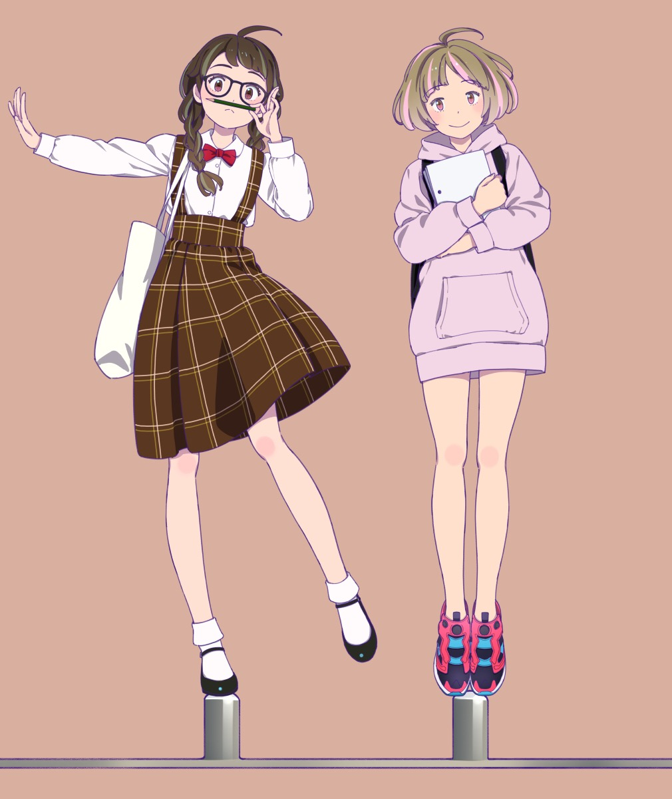
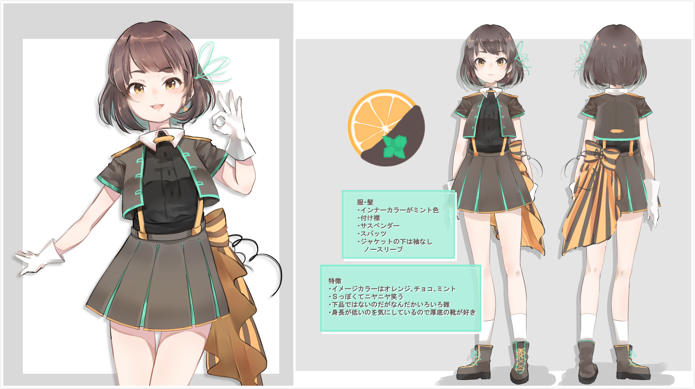
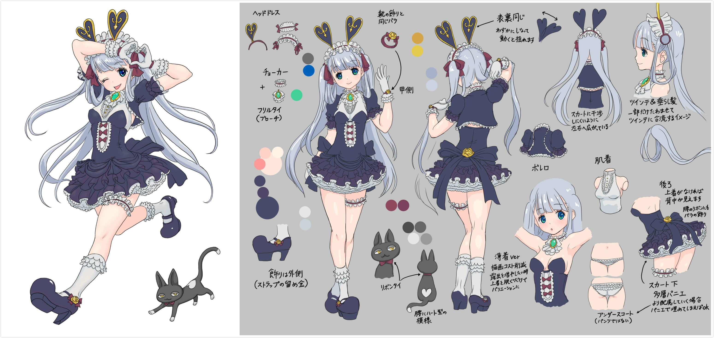
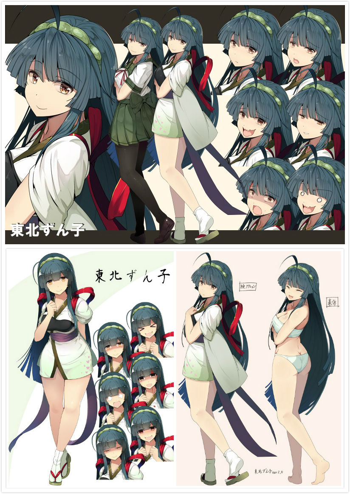
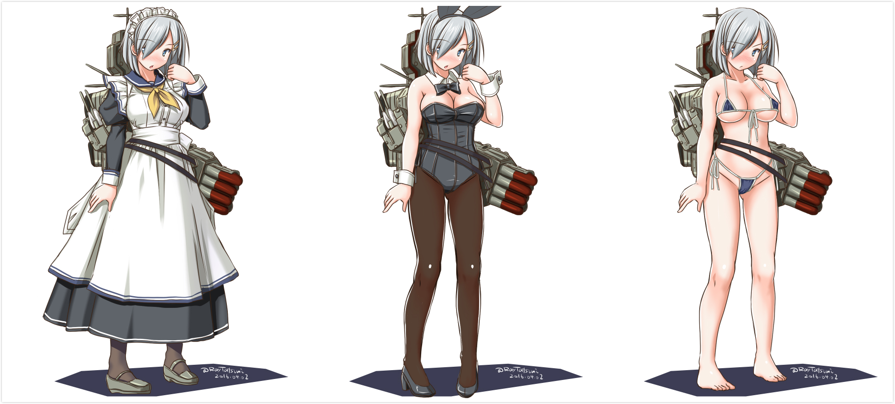
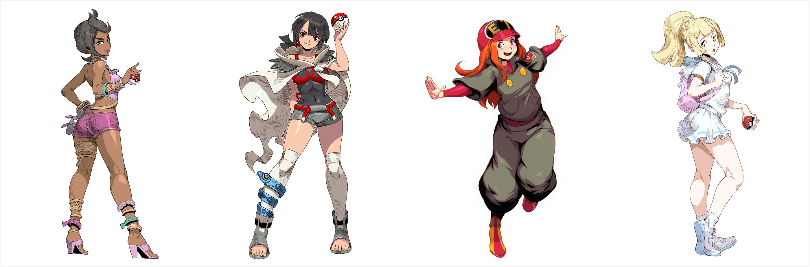
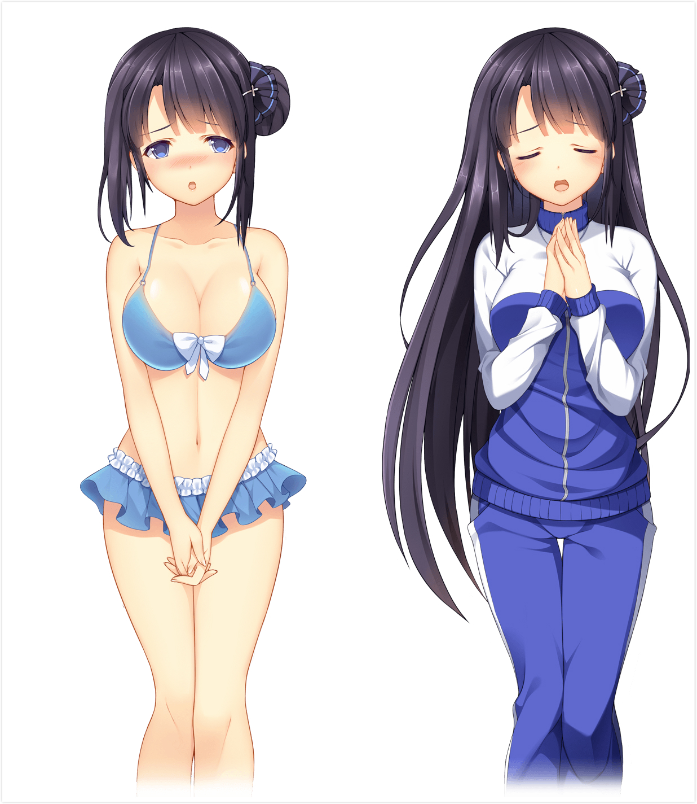

# 女主角

## 目的

创造一名角色，赋予她人物信息和性格，帮助开发人员和玩家直观地认识和了解她。她将有精彩的故事和人生。

## 用途

游戏-角色设计

## 截稿日期

## 单张稿酬预算

## 风格要求

日系

## 稿件规格

1920 * 1080 px（高清电脑屏幕）

## 颜色模式

RGB模式

## 交稿文件格式

PSD

## 画师可否公开发布稿件

按约定公开发布

## 试稿要求

有作品可看可以不需要试稿

## 需求描述
稿件将用于一款2DRPG独立游戏主人公的角色设计，只为创造出一名角色。场景内动画人物，对话头像会参考此设定

非常欢迎可长期合作者，Q版/像素设计者，2D动画，插画设计者

内容：
- 体态1：日常冒险装束的立绘（至少日常冒险/素体2层装束，可有局部的动作差异）
- 体态2：礼服/演出装束的立绘（至少礼服/素体2层装束，可有局部的动作差异）
- 至少3副表情（可在体态图上，也可单独特写）
- 人物信息，性格，甚至可以给出故事
- 线稿，背景，独立的身体，表情，部件，文字等要分层，并且方便矩形切分

角色要求
- 请尽情发挥
- 少女
- 性格可以有瑕疵，但是不能引起人的反感
- 在科学和魔法兼备的世界观中不违和
- 要允许她有冒险的能力（比如最好不要有身体缺陷），允许她身上发生戏剧性的故事或性格转变（比如爱情，比如背叛，比如胆小变勇敢）

## 反馈

在重要创作节点上反馈

## 定义验收阶段
- 保证金
- 草稿
- 文本:人物信息，性格
- 线稿
- 上色
- 收稿

## 参考例图

注意：以下画面用来开阔思路，未必符合上述需求描述

